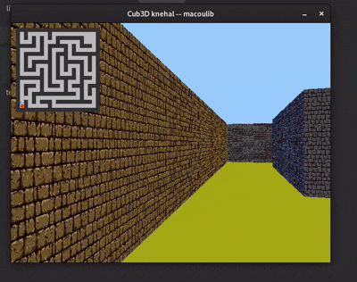

🧊 Cub3D - Raycasting Engine
Un moteur de rendu 3D "old-school" inspiré de Wolfenstein 3D.
📌 À propos

Cub3D est un projet de l'école 42 dont l'objectif est de simuler une vue subjective (FPS) dans un univers 2D en utilisant la technique du Raycasting. Ce projet permet d'approfondir la manipulation de fenêtres, la gestion des pixels et les calculs trigonométriques complexes.

🧠 Notions abordées

    Algorithme DDA (Digital Differential Analyzer) pour le tracé de rayons.

    Trigonométrie (Vecteurs de direction, plan de caméra, calcul de distance euclidienne vs perpendiculaire pour éviter l'effet "fisheye").

    Gestion de la mémoire (Parsing rigoureux et nettoyage des textures).

    Gestion d'événements (Hooks clavier et souris avec la MiniLibX).

🎮 Fonctionnalités

    Rendu 3D temps réel : Projection fluide d'un labyrinthe à partir d'un fichier .cub.

    Textures directionnelles : Affichage de textures différentes pour les faces Nord, Sud, Est et Ouest.

    Système de collision : Le joueur ne peut pas traverser les murs.

    Parsing robuste : Vérification de l'intégrité de la carte (murs fermés, éléments manquants, couleurs de sol/plafond).

🛠️ Installation & Utilisation
Prérequis

    gcc ou clang

    make

    Bibliothèque MiniLibX installée.

Compilation
Bash

# Clone le dépôt
git clone https://github.com/myc42/cub3D

# Compile le projet
make

Lancer le programme
Bash

./cub3D maps/subject.cub

🕹️ Contrôles
Touche	Action
W A S D	Se déplacer dans le labyrinthe
← →	Faire pivoter la caméra
ESC / X	Quitter proprement le programme
📂 Structure du fichier .cub

Le fichier de configuration définit les textures, les couleurs et la structure de la carte :
Plaintext

NO ./path_to_texture_north.xpm
SO ./path_to_texture_south.xpm
F 220,100,0     # Couleur du sol (RGB)
C 225,30,0      # Couleur du plafond (RGB)

111111
100001
10N001
111111

✨ Bonus implémentés

    [x] Mini-map : Visualisation en temps réel de la position du joueur.

    [x] Mouse rotation : Rotation de la caméra à la souris.

